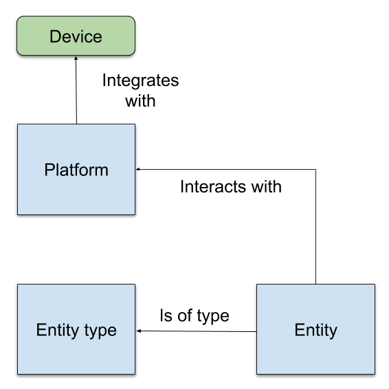
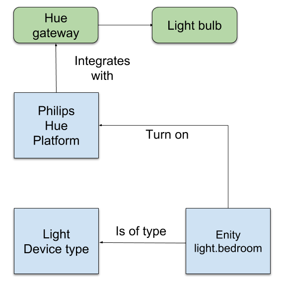

# Basic architecture of MyHome 
Main components in the architeture of the MyHome sofware is the entities and platforms. 

## Platform
All integrations to a external device or service is through an platform. One platform can interact with different types of devices or services, like lights, switches or media players. Example of plattforms:
- IKEA Trådfri
- Philips Hue
- Xiaomi
- Google Cast
## Enity
An entity represents the logical instance you want to control. Like a lightbulb or a temperature sensor. Depending on entity type you can perform different kind of services on the entity, like turn on/off or set/get state. What kind of services suported depends on entity type.
## Enity type
The type of entity controlled.
- Light
- Switch
- Media Player
- Sensor

## Example of a real integration
